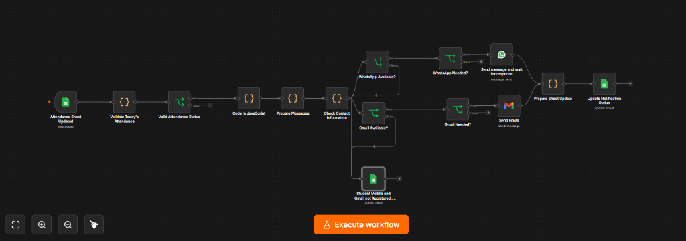
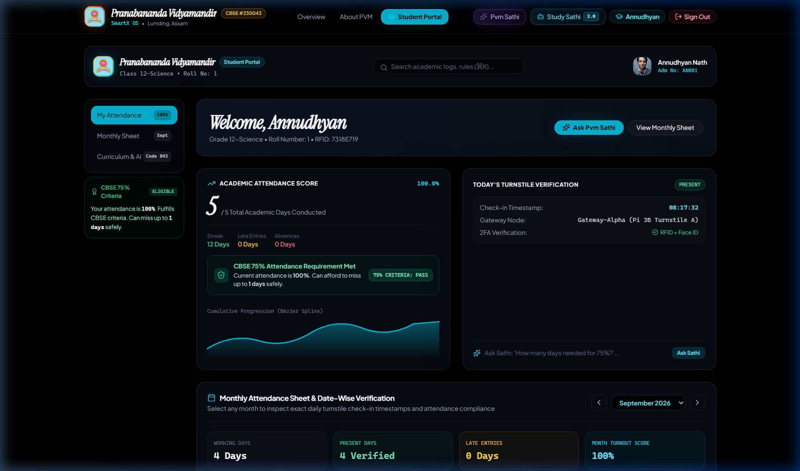
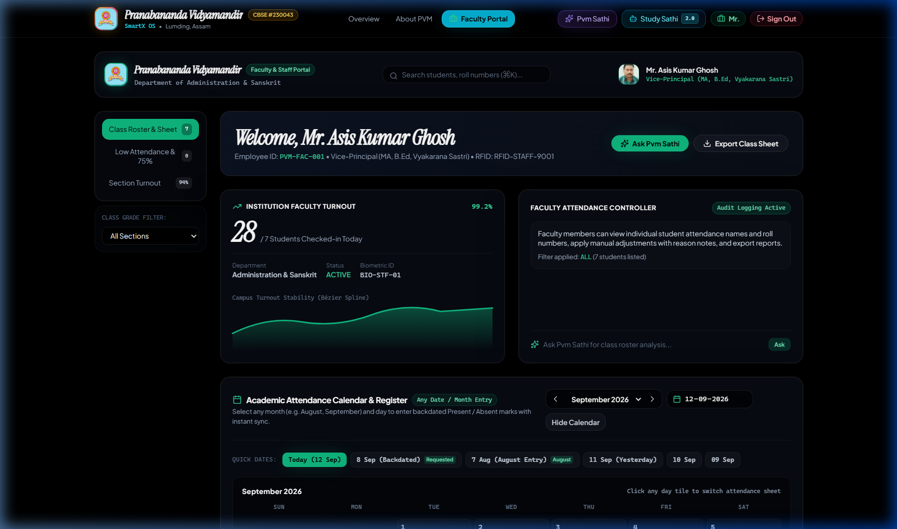
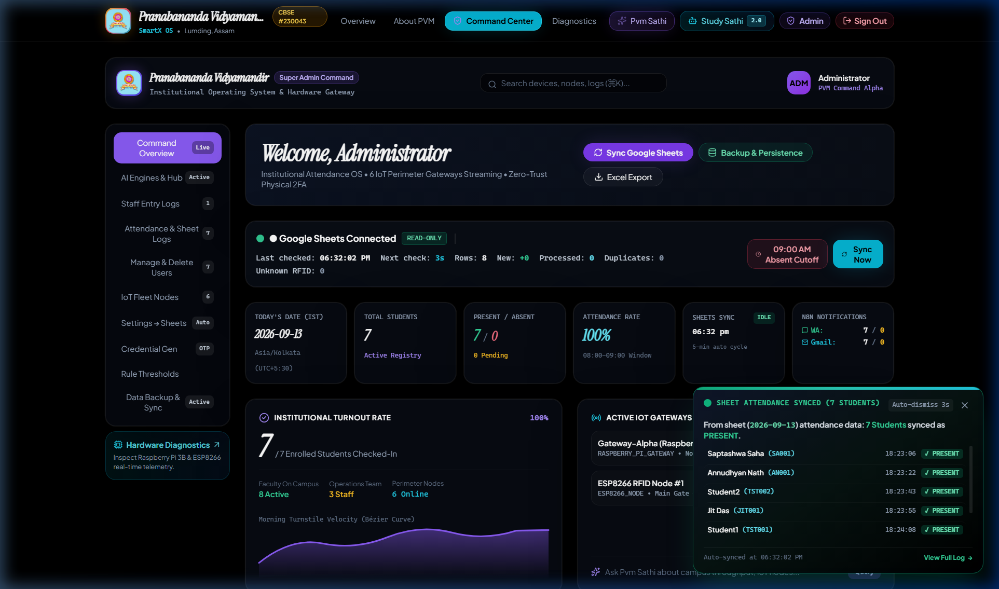
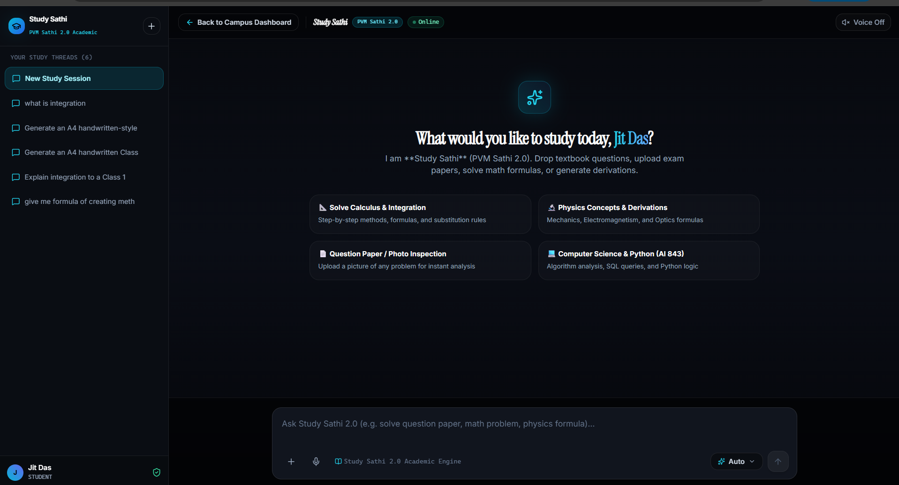
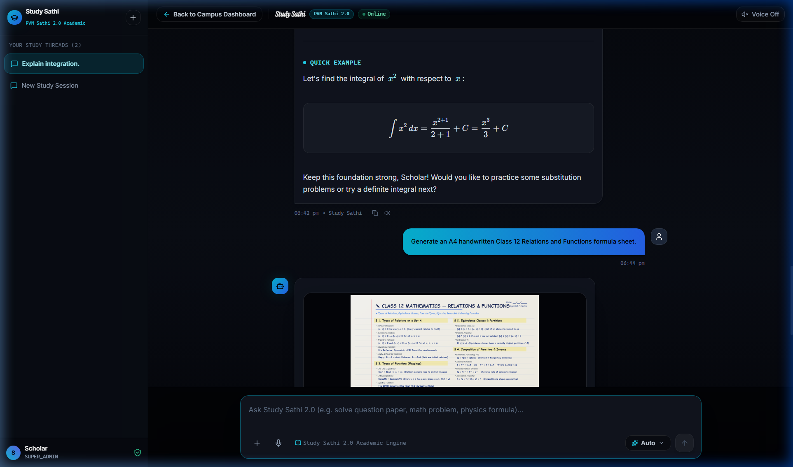

# SmartX • PVM Attendance & Study Sathi Ecosystem
## Comprehensive Project Overview & Presentation Deck

> **Project Name:** SmartX (Pranabananda Vidyamandir Digital Campus Ecosystem)  
> **Platform Components:** IoT Hardware (ESP8266 + RFID) • Google Sheets Real-Time Sync • n8n Parent Notification Pipeline • Multi-Role Web Dashboards (Student, Staff, Admin) • PVM Sathi (Role-Based AI) • Study Sathi 2.0 (Flagship Academic Solver)  
> **Target Audience:** School Administration, Faculty, Parents, and CBSE Class 9–12 Students  

---

# [Presentation Page 1] Executive Summary & Hardware Ingestion Architecture

### 1. The Core Vision
SmartX bridges physical classroom presence with instant cloud data, automated parent communication, and advanced academic intelligence. The system eliminates manual roll-call errors, guarantees zero parent communication latency, and provides every student with an individualized AI academic companion.

```
       [Student Scans RFID Card]
                   │
                   ▼
       [ESP8266 IoT RFID Reader]
                   │
                   ├──► [Google Sheets Attendance Database] (Real-time Cloud Log)
                   │              │
                   │              ▼
                   │     [n8n Workflow Engine]
                   │              │
                   │              ├──► [WhatsApp Notification] (Instant to Parent)
                   │              └──► [Gmail Notification]    (Instant to Parent)
                   │
                   ▼
    [SmartX Web Application & Dashboard Engine]
    ├── Student Panel (Turnout, 75% CBSE Eligibility, Calendar)
    ├── Faculty Panel (Class Turnout, Registers, Manual Sync)
    ├── Admin Panel   (Roster, Google Sheets Sync Monitor, RFID Map)
    └── Study Sathi 2.0 (Class 9-12 Step-by-Step Solver & Vision AI)
```

### 2. IoT Hardware Layer (ESP8266 + RFID)
1. **Physical Tapping Event**: Every student and staff member carries an RFID smart identity card containing a unique UID chip.
2. **Contactless Scanning**: Upon entering the campus turnstile or classroom door, the card is tapped against an **ESP8266 Wi-Fi micro-controller paired with an RC522 RFID reader**.
3. **Dual Pipeline Ingestion**:
   - The microcontroller immediately transmits the scan payload (`RFID UID`, `Student ID`, `Timestamp`, `Gateway ID`) to the **Google Sheets Attendance Register**.
   - Simultaneously, the event is acknowledged by the **SmartX Web Platform**.
4. **Automated Status Allocation**:
   - **Present**: Scanned before the campus cutoff time.
   - **Late**: Scanned after the morning prayer/bell.
   - **Absent**: Automatically marked at the end of the morning attendance window if no scan event occurred for that student ID.
5. **Bi-Directional Google Sheet Sync Engine**:
   - Built with an active real-time sync service (`AttendanceSyncEngine`) that continuously synchronizes Google Sheets and web app state.
   - If an administrator or teacher updates attendance in the Google Sheet, the web application updates automatically within seconds.

---

# [Presentation Page 2] Automated Parent Notification Engine (n8n Workflow)

### 1. What is n8n?
> **n8n** is a powerful low-code workflow automation platform that connects different apps, APIs, and AI services together using a visual interface, while relying heavily on JSON format coding and JavaScript for advanced data manipulation.

### 2. End-to-End Workflow Architecture
The SmartX attendance automation executes on n8n. Below is the production workflow orchestrating daily parent notifications:



### 3. Step-by-Step Node Breakdown

| Step # | Node Name | Technology / Function | Detailed Logic & Anti-Spam Safeguards |
|:---:|:---|:---|:---|
| **1** | **Attendance Sheet Updated** | Google Sheets Trigger | Automatically triggers the pipeline each morning whenever the attendance sheet updates, even if only one student scan is logged. |
| **2** | **Validate Today's Attendance** | Code with JavaScript | **Strict Date & Anti-Spam Filter**: Executes JavaScript that isolates records matching *today's date only* (strictly ignoring historical dates). Checks the notification log to ensure that if a parent has already received a notification today for WhatsApp or Gmail, they **do not receive duplicate messages**, eliminating notification spam. |
| **3** | **Valid Attendance Status** | Switch / Logic Node | Analyzes scan time against morning institutional criteria to categorize each student into one of three statuses: **Present**, **Absent**, or **Late**. |
| **4** | **Code in JavaScript** | JavaScript Data Normalizer | Prepares and standardizes the data payload into clean JSON structures mapped to student roster profiles. |
| **5** | **Prepare Messages** | Template Formatter | Dynamically generates personalized, polite, and official notification templates for both WhatsApp and Email (e.g., *"Dear Parent, your child [Student Name] of Class 12-A was marked Present at 08:14 AM."*). |
| **6** | **Check Contact Information** | Validation & Routing | Inspects whether the student record contains a valid registered parent WhatsApp mobile number and/or Gmail address. |
| **7a** | **Student Mobile & Gmail Not Registered** | Google Sheets Action | **Action-Required Branch**: If both phone and email are missing, logs the student into a dedicated *"Action Required: Missing Contact Information"* sheet so school administration can immediately reach out to the family. |
| **7b** | **WhatsApp Available? ➔ WhatsApp Needed? ➔ Send WhatsApp** | WhatsApp API Node | Dispatches an instant WhatsApp message to the parent's mobile phone and confirms transmission receipt. |
| **7c** | **Gmail Available? ➔ Gmail Needed? ➔ Send Gmail** | Gmail API Node | Sends an official attendance alert email directly to the parent's inbox. |
| **8** | **Prepare Sheet Update ➔ Update Notification Status** | Google Sheets Updater | Writes back delivery confirmations and timestamps into the master Google Sheet, ensuring a permanent audit trail and guaranteeing zero repeat messages. |

---

# [Presentation Page 3] Student Web Dashboard & CBSE 75% Eligibility Tracker

### 1. Student Portal Overview
Students log in to access an intuitive, high-contrast dashboard tailored specifically to their daily attendance standing and academic progress.



### 2. Key Student Capabilities
- **Real-Time Attendance Score**: Live display of overall attendance percentage (e.g. `100.0%`).
- **CBSE 75% Criteria Tracker**:
  - Automatically calculates student compliance against the mandatory CBSE 75% attendance threshold.
  - Dynamically calculates: *"How many more consecutive days must you attend to reach or maintain 75% eligibility?"*
- **Monthly Turnout Calendar & Heatmap**: Color-coded visualization of present, late, absent, and holiday records.
- **Turnstile Verification Log**: Instant visual confirmation showing the exact time and gateway where the student's RFID card was logged today.

### 3. PVM Sathi (AI Assistant for Students)
Embedded directly inside the student portal is **PVM Sathi**, a specialized conversational assistant:
- **Attendance Inquiries**: Students can ask natural questions such as:
  - *"Was I marked present today?"*
  - *"How many classes have I attended this month?"*
  - *"Which of my classmates from Class 12-A were present today?"* (The AI answers respectfully using authorized class attendance logs).
- **Personalized Academic Encouragement**: Provides study reminders, time-management tips, and motivational guidance.

---

# [Presentation Page 4] Faculty Portal & Institutional Administration

### 1. Faculty & Staff Dashboard
Designed for class teachers, subject educators, and administrative heads to monitor turnout without cumbersome paper registers.



- **Class-Wise Turnout Monitoring**: View real-time percentages of students present across different grades and sections.
- **Backdated Attendance Register**: Inspect attendance logs for any selected historical date.
- **Manual Attendance Overrides**: One-click toggle to mark excused absences, medical leave, or school sports duty.
- **PVM Sathi for Faculty**:
  - Teachers can ask: *"Give me a list of students who have been absent for 3 consecutive days."*
  - Generates absentee summaries and drafts follow-up messages for parents in seconds.

---

### 2. Master Institutional Admin Control Panel
The school principal and IT administrators have full oversight of hardware devices, cloud sync, and the student roster.



- **Bi-Directional Google Sheets Health Monitor**: Real-time indicator displaying connection status, spreadsheet ID, detected sheets, and automated sync interval (every 10 seconds).
- **IoT Gateways & Hardware Telemetry**: Monitors RFID turnstile devices across Campus Gates 1, 2, and library turnstiles.
- **Student & Staff Master Roster**: Search, filter, and edit student records (name, roll number, class, section, parent mobile, parent email, RFID UID chip ID).
- **PVM Sathi for Admin**:
  - Executes administrative commands via natural language (e.g., *"Update RFID card for Roll 14 to UID 83A19C4D"*, *"Check Google Sheet synchronization status"*).

---

# [Presentation Page 5] Flagship Academic Engine: Study Sathi 2.0

### 1. The Vision of Study Sathi 2.0
Study Sathi 2.0 is an academic intelligence engine created specifically for students of **Pranabananda Vidyamandir (PVM)**. Built for CBSE Class 9 to 12 curricula, it acts as a 24/7 personal tutor across **Mathematics, Physics, Chemistry, and Biology**.



### 2. Core Superpowers of Study Sathi 2.0

#### A. Step-by-Step Problem Solver
- Solves complex mathematical questions including **Calculus, Integrals, Differential Equations, Relations & Functions, Matrices, Determinants, Vectors, and Probability**.
- For Chemistry: balances complex chemical reactions (e.g. Grignard reagents, organic synthesis mechanisms).
- For Physics: derives formulas and solves numerical problems with step-by-step reasoning ($F = ma$, kinematics, electrostatics, ray optics).

#### B. Multimodal Vision Analysis
- Students can upload a **photograph of a handwritten question, textbook diagram, or an entire CBSE question paper PDF**.
- Study Sathi analyzes the image, extracts the text and mathematical equations, and delivers systematic, step-by-step solutions.

#### C. Sathi Creative Engine (Precision Study & Revision Sheet Generator)
- Generates 100% readable, mathematically verified, structured handwritten revision sheets for specific topics (e.g. *Class 12 Relations and Functions*, *Matrices & Determinants*, *Alcohols & Phenols Reactions*).
- **High-Resolution Vector Precision**: Solves the problem of blurry AI diffusions by rendering exact mathematical notation, clear headers, and organized formula boxes on authentic ruled student paper in dark blue ink.



- *Upcoming Evolution*: We will incorporate dedicated local rendering hardware to produce ultra-high-definition, publication-grade printable study sheets locally without external dependency.

#### D. Proprietary PVM Branding & Identity
- **Branded Strictly as PVM Team Technology**: Study Sathi maintains strict privacy and never exposes external AI vendors, model switches, or API keys.
- **Creator Identity**: When asked *"Who created you?"*, Study Sathi responds proudly and deterministically:  
  > *"I was created by the PVM Team to serve as your dedicated academic assistant."*
- **Tiered Model Architecture**:
  - **Sathi Flash**: Lightning-fast query answering and short explanations.
  - **Sathi Vision**: Document, PDF, and question paper image interpretation.
  - **Sathi 3.8**: Heavy-duty mathematical reasoning, multi-step problem solving, and CBSE curriculum mastery.

---

# [Presentation Page 6] Future Roadmap & Next-Generation Innovations

### 1. Automated Curriculum-Aware Quiz & Diagnostic Testing
- **Exam Schedule Awareness**: Study Sathi will be synchronized with the official PVM academic calendar and exam schedules.
- **Automated Practice Tests**: As unit tests and board exams approach, the AI will automatically generate personalized practice quizzes.
- **Instant Automatic Scoring**: Evaluates answers, provides diagnostic score reports, and highlights specific weak topics (e.g. *Weakness in Integration by Parts*).
- **Institutional Early Warning Intervention**: If a student consistently scores poorly or demonstrates learning gaps across multiple quizzes, the system automatically alerts teachers and parents so timely remedial classes can be arranged.

### 2. Socratic "Learning Mode"
- Instead of immediately revealing the final answer to homework questions, the student can activate **Learning Mode**.
- The AI acts like an expert tutor: asking guiding questions, offering intermediate hints, and encouraging the student to think through each step.
- The AI checks the student's reasoning in real-time, building true conceptual mastery rather than rote memorization.

### 3. High-Performance Edge Rendering Device
- Integration of a dedicated local graphics computing module inside the school campus to render ultra-sharp, printable A4 educational study sheets, infographics, and mathematical charts locally without external cloud dependency.

---

## Presentation Summary Table

| Layer | Technology | Key Functionality | Primary Beneficiary |
|---|---|---|---|
| **Hardware / IoT** | ESP8266 + RC522 RFID | Contactless, instantaneous campus attendance tap-in | Students & Security |
| **Data Backbone** | Google Sheets + SheetSync Engine | Live bi-directional cloud attendance register | Administration & Faculty |
| **Parent Alerts** | n8n Workflow Automation | Zero-spam WhatsApp & Gmail notifications with missing-data alerts | Parents & Guardians |
| **Web Platform** | React, Tailwind, TypeScript | Student, Staff, and Admin management portals with 75% tracker | Entire School Community |
| **School AI** | PVM Sathi | Role-based contextual assistant for attendance and operations | Students, Teachers, Admins |
| **Academic AI** | Study Sathi 2.0 (Sathi 3.8) | Step-by-step CBSE solver, multimodal vision question analyzer | CBSE Students (9–12) |
| **Creative Engine** | Sathi Creative | A4 revision and handwritten study sheet generator | Exam Revision Students |
