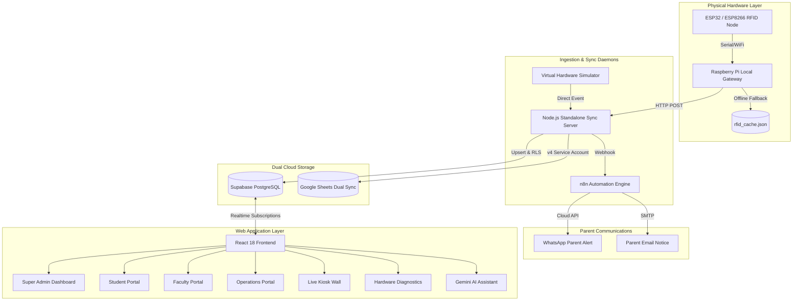

# SmartAttend — Master Project Documentation & AI Blueprint (`prompt.md`)

> **Institutional IoT & Cloud Attendance Management System for Pranabananda Vidyamandir**  
> *A full-stack, hardware-integrated, dual-cloud synchronized, role-isolated, and AI-powered educational management platform.*

---

## Table of Contents
1. [Project Executive Overview](#1-project-executive-overview)
2. [Skills, Frameworks & Core Elements Used](#2-skills-frameworks--core-elements-used)
3. [Architecture & System Design](#3-architecture--system-design)
4. [Hardware & IoT Integration](#4-hardware--iot-integration)
5. [Cloud, Database & Dual-Sync Pipeline](#5-cloud-database--dual-sync-pipeline)
6. [Role-Based Access Control & Portals](#6-role-based-access-control--portals)
7. [AI Intelligence & Automation Layer](#7-ai-intelligence--automation-layer)
8. [How This Project Was Built (Step-by-Step)](#8-how-this-project-was-built-step-by-step)
9. [The Master AI Prompt (How Any AI Can Build It From Scratch)](#9-the-master-ai-prompt-how-any-ai-can-build-it-from-scratch)
10. [Repository Directory Blueprint](#10-repository-directory-blueprint)

---

## 1. Project Executive Overview

**SmartAttend** is an enterprise-grade IoT attendance and institutional analytics platform engineered specifically for **Pranabananda Vidyamandir**. It bridges physical classroom hardware with high-performance cloud databases, live public dashboards, administrative management panels, student/staff portals, and real-time parent notifications.

### Key Capabilities:
- **Sub-100ms RFID Ingestion**: Physical RFID cards read via RC522 sensors attached to ESP32/ESP8266 microcontrollers and Raspberry Pi edge gateways.
- **Offline-First Resilience**: Local JSON caching on edge nodes ensuring zero data loss during school Wi-Fi or broadband outages, with auto-replay upon reconnection.
- **Dual-Cloud Synchronization**: Bi-directional, idempotent synchronization between **Supabase (PostgreSQL)** and **Google Sheets API v4** with automated daily date tab provisioning.
- **Multi-Role Isolation**: Strict, authenticated separation for **Super Admins**, **Faculty & Staff**, **Students**, and **Operations Employees**.
- **Automated Omnichannel Alerting**: Real-time WhatsApp Cloud API and Gmail notification triggers via **n8n** webhooks upon student tap-in or unexcused absence cutoff (09:00 AM IST).
- **Embedded AI Assistant**: Role-guarded Gemini AI integration providing natural language attendance metrics, analytics summaries, and automated diagnostic reports.
- **Apple Fluid Design & Kinetic Aesthetics**: Built following Apple WWDC fluid interface principles (spring physics, direct manipulation, instant pointer feedback) combined with GSAP choreography and 21st.dev radiant components.

---

## 2. Skills, Frameworks & Core Elements Used

The project was architected by combining cutting-edge UI skills, animation libraries, hardware protocols, and serverless cloud services:

### A. Apple Design System (`skills/apple-design`)
- **Fluid Spring Physics**: Every motion and transition is driven by physical mass, stiffness, and damping (`damping: 1.0` for critically damped interfaces, `0.8` for momentum-based release gestures).
- **Direct Pointer Manipulation**: Modals, drawer controls, and hardware simulators respond 1:1 with pointer coordinates, retaining initial grab offsets.
- **Mid-Motion Interruptibility**: Zero locked-out states. Animations calculate transforms from their live presentation values on the DOM, allowing users to reverse or grab elements mid-flight.
- **Latency Elimination**: Buttons and controls activate on `pointerdown` (<16ms) rather than waiting for `click` / mouse-up.
- **Translucent Depth & Materials**: Multi-layer dark backdrops (`#000000`), frosted glass (`backdrop-blur-xl`), and crisp borders (`border-white/[0.08]`).

### B. GSAP Animation Suite (`skills/gsap-*`)
- **`gsap-core`**: High-performance tweens utilizing CSS transforms and opacity exclusively to bypass browser layout reflows.
- **`gsap-timeline`**: Structured sequencing for portal switches, modal entrances, and live statistics counter increments.
- **`gsap-scrolltrigger`**: Scroll-driven storytelling, interactive pin states, and viewport reveals across the Landing and About pages.
- **`gsap-performance`**: Strict adherence to hardware acceleration (`will-change`, transform sub-pixel rendering, context cleanup on React unmounts).

### C. MotionSites AI & 21st.dev UI Elements (`skills/motion-sites` & `skills/21st-dev`)
- **Radiant Buttons & Glow Cards**: Concentric dynamic glow borders tracking cursor motion via CSS radial gradients and motion values (`src/components/ui/glow-card.tsx`).
- **Dancing Letters**: Interactive typographic animation on hero headers that react to cursor proximity with smooth spring returns (`src/components/ui/dancing-letters.tsx`).
- **Handwriting Text**: Vector SVG path drawing animations that simulate live handwriting for institutional badges (`src/components/ui/handwriting-text.tsx`).
- **Modern Animated Sign-In**: Multi-step glassmorphic authentication view with animated role badges, visual input indicators, and ambient backdrops (`src/pages/LoginPage.tsx`).
- **Floating Command Palette**: `Cmd+K` / `Ctrl+K` quick-action overlay allowing instant navigation, student lookups, simulation triggers, and diagnostic audits (`src/components/common/CommandPalette.tsx`).

### D. Core Technologies
| Category | Technology | Usage |
|---|---|---|
| **Frontend Framework** | React 18 + TypeScript | Component tree, custom hooks, type safety |
| **Build Tooling** | Vite 6 | Fast HMR, optimized bundle chunking |
| **Styling** | Tailwind CSS + PostCSS | Tokenized atomic design system, glassmorphism |
| **Database & Realtime** | Supabase (PostgreSQL 15) | Relational records, Row Level Security (RLS), Realtime WebSocket channels |
| **Cloud Spreadsheets** | Google Sheets API v4 | Dual-logging, administrative reporting, daily class sheets |
| **Microcontrollers** | ESP32, ESP8266, Raspberry Pi | RFID RC522 scanning, buzzer/LCD feedback, edge caching |
| **Automation** | n8n Webhooks | WhatsApp Business API, Gmail parent notifications |
| **AI Intelligence** | Google Gemini API (`@google/genai`) | Contextual queries, natural language attendance insights |
| **Export Engines** | SheetJS (`xlsx`) + Canvas-Confetti | Instant CSV/Excel institutional exports and gamified rewards |

---

## 3. Architecture & System Design

SmartAttend follows an event-driven, decoupled architecture ensuring that hardware delays or cloud outages never block student entry:



---

## 4. Hardware & IoT Integration

### 1. ESP32 Node (`hardware/esp32/rfid_sheet_node.ino`)
- **Peripherals**: MFRC522 RFID reader (SPI: SCK 18, MISO 19, MOSI 23, SS 5, RST 22), 16x2 I2C LCD display (Address `0x27`), dual status LEDs (Green = Approved, Red = Duplicate/Error), and Piezo Buzzer.
- **Workflow**:
  1. Detects card presence on SPI bus.
  2. Extracts hexadecimal UID string (e.g. `E2-A8-1C-4B`).
  3. Debounces rapid multiple swipes (minimum 3-second lockout per UID).
  4. Displays student name & status on LCD; emits distinct audio chime.
  5. Transmits JSON payload over Wi-Fi to sync server with battery/signal diagnostics.

### 2. ESP8266 Node (`hardware/esp8266/rfid_node.ino`)
- Lightweight variant for satellite gates with direct HTTP POST dispatch to local proxy or cloud webhook.

### 3. Raspberry Pi Edge Gateway (`hardware/raspberry_pi/`)
- **`gateway.py`**: Intercepts USB/Serial scans from microcontrollers.
- **`sheet_sync_daemon.py`**: Monitors network connectivity. When offline, queues records into `rfid_cache.json`. When internet returns, replays queued records with original timestamps and sets `replayFlag=true`.
- **Dual-Posting**: Feeds both local SQLite/JSON logs and remote Supabase endpoints.

### 4. Built-in Hardware Simulator (`src/components/hardware/HardwareSimulatorModal.tsx`)
- Allows full system testing in development environments without physical hardware:
  - Simulate registered/unregistered card swipes.
  - Test rapid double-tap rejection.
  - Simulate gate latency and network packet drops.
  - Trigger emergency lockouts and battery level drops.

---

## 5. Cloud, Database & Dual-Sync Pipeline

### Supabase Relational Schema (`supabase/migrations/`)
- **`students`**: Master student directory (ID, name, class grade, section, roll number, RFID UID, parent contacts, active status).
- **`staff`**: Faculty records, departmental assignments, designation, RFID UID.
- **`employees`**: Institutional support, security, lab attendants, and administrative staff.
- **`attendance_records`**: Universal attendance logs with fields for check-in time, date, person type (`STUDENT`, `STAFF`, `EMPLOYEE`), status (`PRESENT`, `LATE`, `ABSENT`), verification method (`RFID_SCAN`, `MANUAL_OVERRIDE`, `BIOMETRIC`), and sync flags.
- **`attendance_sync_queue`**: Idempotent queue ensuring scans are not processed twice across distributed devices.
- **`iot_devices`**: Hardware health registry tracking device ID, gate name, battery level, RSSI Wi-Fi signal, firmware version, and last heartbeat.

### Google Sheets Dual-Sync Engine (`src/services/attendanceSyncEngine.ts` & `server/standaloneSyncServer.js`)
- **Service Account Integration**: Communicates with Google Sheets API v4 using cryptographically signed JWT tokens (`service-account.json`).
- **Daily Date Tab Creation**: Checks if a tab named with today's date (e.g., `2026-09-10`) exists. If missing, auto-creates it with frozen headers and conditional formatting.
- **Formula Injection Defense**: All phone numbers starting with `+` are automatically prepended with a single quote (`'+919876543210`) to prevent Google Sheets from interpreting them as formulas and causing `#ERROR!`.
- **Windowed Attendance Processing**:
  - `08:00 AM - 08:30 AM IST`: Marked `PRESENT`.
  - `08:31 AM - 09:00 AM IST`: Marked `LATE`.
  - `> 09:00 AM IST`: All registered students without scans auto-flagged as `ABSENT`.

---

## 6. Role-Based Access Control & Portals

The application implements client and server-side role gating:

```typescript
// Strict Role Isolation Gate (src/App.tsx)
const canAccessStudent  = isAuthenticated && (userRole === 'STUDENT' || userRole === 'SUPER_ADMIN');
const canAccessStaff    = isAuthenticated && (userRole === 'STAFF' || userRole === 'SUPER_ADMIN');
const canAccessEmployee = isAuthenticated && (userRole === 'EMPLOYEE' || userRole === 'SUPER_ADMIN');
const canAccessAdmin    = isAuthenticated && (userRole === 'SUPER_ADMIN' || userRole === 'ADMIN');
```

### 1. Super Admin Dashboard (`src/pages/AdminDashboard.tsx`)
- **Real-Time KPIs**: Live counters for total attendance, present/late/absent rates, active IoT gates, and cloud sync latency.
- **Student & Staff Management**: Add, update, archive, and assign RFID UIDs with live duplicate validation.
- **Attendance Processing Engine**: One-click manual batch processing, Google Sheets re-sync, and WhatsApp notification dispatch.
- **Export Facility**: Instant Excel (`.xlsx`) sheet generation grouped by grade and section.

### 2. Student Portal (`src/pages/StudentPortal.tsx`)
- Individual monthly attendance calendar, streak tracker, institutional announcements, timetable, and automated attendance certificate downloads.

### 3. Faculty & Staff Portal (`src/pages/StaffPortal.tsx`)
- Departmental check-ins, class attendance verification, manual student attendance overrides with audit logging, and leave management.

### 4. Operations Employee Portal (`src/pages/EmployeePortal.tsx`)
- Shift tracking for security guards, lab technicians, housekeeping, and ground staff with check-in/check-out timestamps.

### 5. Live Attendance Wall (`src/pages/LiveAttendanceWall.tsx`)
- Fullscreen kiosk display designed for entrance lobby monitors:
  - Real-time animated cards sliding in on every card swipe.
  - Green/Orange status badges with photo, name, grade, and timestamp.
  - Institutional clock, live headcounts, and celebratory confetti on perfect streaks.

### 6. Diagnostics & IoT Gate Health (`src/pages/DiagnosticsPage.tsx`)
- Real-time gate telemetry, ping monitors, battery voltage meters, Wi-Fi signal gauges, and raw packet inspection.

---

## 7. AI Intelligence & Automation Layer

### Google Gemini Integration (`src/services/aiIntelligence.ts`)
- **Role-Aware Context**: The AI adapts its tone and scope depending on who is logged in:
  - *Students*: Receives their personal attendance percentage, remaining allowed leaves, and upcoming schedule.
  - *Staff*: Receives class averages, chronic absentee lists, and anomaly alerts.
  - *Admin*: Receives school-wide insights, gate bottleneck predictions, and sync integrity reports.
- **Safe Structured Calculations**: Hard mathematical calculations (percentage, streaks, present counts) are computed deterministically in TypeScript and injected into Gemini prompts to eliminate LLM hallucinations.
- **Offline Fallback**: Rule-based natural language parser if Gemini API rate limits or network dropouts occur.

---

## 8. How This Project Was Built (Step-by-Step)

1. **Step 1: Foundational Architecture & Configuration**
   - Configured Vite + React 18 + TypeScript with Tailwind CSS tokens tailored for a dark glassmorphic design system (`#000000` base, cyan and emerald accents).
   - Set up `.env` and `mcp_config.json` for 21st.dev and MotionSites MCP servers.

2. **Step 2: Database Schema & Supabase Migrations**
   - Wrote relational SQL migrations with PostgreSQL row-level security, indexing on `rfid_uid`, `date`, and `person_id`.
   - Seeded 500+ realistic records for Pranabananda Vidyamandir across Grades 9–12, faculty, and support employees.

3. **Step 3: Hardware Firmware & Edge Daemon Scripts**
   - Programmed ESP32 C++ firmware with SPI RC522 integration, LCD I2C drivers, and JSON HTTP requests.
   - Built Python Raspberry Pi edge sync daemon with local offline caching (`rfid_cache.json`).

4. **Step 4: Dual-Cloud Sync Engine & Node.js Server**
   - Developed Google Sheets v4 service with JWT auth, auto-sheet formatting, and phone number sanitization.
   - Created `standaloneSyncServer.js` daemon to bridge Supabase real-time webhooks with Google Sheets updates.

5. **Step 5: Apple-Design & 21st.dev Component Library**
   - Built responsive UI components (`glow-card`, `dancing-letters`, `handwriting-text`, `CommandPalette`).
   - Ensured zero latency, physics-based spring curves, and pointer capture drag mechanics.

6. **Step 6: Multi-Portal Routing & View Assembly**
   - Implemented role-based route guard in `App.tsx`.
   - Created specialized views: Super Admin Dashboard, Student Portal, Staff Portal, Employee Portal, Live Kiosk Wall, and Diagnostics Page.

7. **Step 7: AI Intelligence Drawer & Notification Pipeline**
   - Connected Google Gemini 1.5/2.0 API with structured prompt wrappers.
   - Configured n8n webhook triggers for WhatsApp Cloud API and Gmail alerts.

8. **Step 8: Hardening & Testing**
   - Built the virtual hardware simulator to test edge conditions (rapid double-swipes, unregistered cards, power drops).
   - Verified 60fps animations with GSAP and verified zero layout reflows.

---

## 9. The Master AI Prompt (How Any AI Can Build It From Scratch)

*Use the prompt below in any LLM or AI coding agent to generate the complete SmartAttend application from zero.*

```markdown
### SYSTEM ROLE
You are an expert Principal Full-Stack Engineer, IoT Solutions Architect, and Apple-grade UI/UX Designer. Your task is to build from scratch "SmartAttend", an enterprise-grade IoT RFID attendance and institutional management system for Pranabananda Vidyamandir.

### DESIGN & AESTHETIC DIRECTIVES
1. Follow Apple Fluid Interface principles:
   - All animations must use spring physics (damping: 1.0 default, 0.8 for momentum release).
   - Never lock out user input during an animation (interruptibility mid-motion).
   - Eliminate input latency: buttons and controls must activate on pointerdown (<16ms).
2. Use dark-mode luxury glassmorphism:
   - Background: Pure black `#000000`, slate surfaces `#090d16`, borders `white/[0.08]`.
   - Vibrant accent glows: Cyan (`#06b6d4`), Emerald (`#10b981`), Amber (`#f59e0b`), Rose (`#f43f5e`).
3. Modern kinetic typography and ambient effects:
   - Concentric mouse-tracking radial glows.
   - Command palette (Cmd+K / Ctrl+K).
   - GSAP timeline-managed counter ticks and entrance staggers.

### TECHNICAL SPECIFICATIONS & TECH STACK
- Frontend: React 18, Vite, TypeScript, Tailwind CSS, Lucide React, Framer Motion, GSAP, Canvas-Confetti, SheetJS (xlsx).
- State: Single comprehensive React Context with local storage persistence and mock fallback data.
- Database: Supabase (PostgreSQL 15) with RLS policies, real-time channels, and tables for students, staff, employees, attendance_records, and iot_devices.
- Dual-Sync: Google Sheets API v4 integration with service account JWT authentication, automatic daily tab creation, and phone formula injection protection.
- Hardware & Edge: ESP32 Arduino C++ firmware (RC522, I2C LCD, LEDs, Buzzer) and Raspberry Pi Python daemon with offline JSON caching.
- Automation: n8n webhook triggers sending WhatsApp Cloud API and Gmail messages to parents for check-ins and unexcused absences.
- AI Intelligence: Google Gemini API integration with deterministic metric calculation wrappers and role-based prompt context.

### STEP-BY-STEP IMPLEMENTATION ROADMAP
1. Create `package.json`, `tsconfig.json`, `tailwind.config.js`, `vite.config.ts`, and `.env.example`.
2. Write Supabase SQL migration files defining relational tables, foreign keys, timestamps, and indexes.
3. Build the core types (`src/types/index.ts`) covering Student, Staff, Employee, AttendanceRecord, IoTDevice, and UserRole.
4. Implement realistic institutional seed data (`src/data/seedData.ts`) covering grades 9-12 with valid RFID UIDs.
5. Build the UI component kit:
   - `GlowCard`: Cursor-tracking radial gradient border.
   - `DancingLetters`: Interactive spring-return characters.
   - `HandwritingText`: SVG path animation.
   - `CommandPalette`: Keyboard-navigable quick command runner.
6. Build the services layer:
   - `googleSheetsService.ts`: OAuth2 JWT signing, read/append/create sheets.
   - `attendanceSyncEngine.ts`: Time-window validation (08:00-09:00 AM IST), auto-absent logic, idempotency check.
   - `aiIntelligence.ts`: Gemini chat completions with offline fallback.
7. Build the application portals:
   - `LandingPage`: Showcase hero, live stats, feature highlights.
   - `AdminDashboard`: Master control center with KPIs, student table, sync logs, and export buttons.
   - `StudentPortal`: Personal calendar, streak tracker, and attendance certificate.
   - `StaffPortal`: Faculty check-ins and manual attendance override modal.
   - `EmployeePortal`: Staff duty tracking and hourly shifts.
   - `LiveAttendanceWall`: Fullscreen entry kiosk with animated swipe cards.
   - `DiagnosticsPage`: Real-time IoT gate health, battery voltage, and packet logs.
   - `HardwareSimulatorModal`: Virtual RFID tap tester.
8. Wire everything in `App.tsx` with role-based routing and top navigation bar.
```

---

## 10. Repository Directory Blueprint

```
├── .agents/skills/              # Specialized design & animation skills
│   ├── apple-design/            # Apple fluid physics & WWDC guidelines
│   ├── gsap-*/                  # GSAP core, timeline, scrolltrigger, performance
│   ├── motion-sites/            # MotionSites AI kinetic templates
│   └── 21st-dev/                # 21st.dev UI component library
├── hardware/                    # Embedded microcode & edge scripts
│   ├── esp32/rfid_sheet_node.ino # ESP32 Arduino RFID + LCD + Wi-Fi code
│   ├── esp8266/rfid_node.ino    # ESP8266 lightweight RFID client
│   └── raspberry_pi/            # Gateway & offline cache daemons
│       ├── gateway.py           # Serial reader & cloud forwarder
│       ├── sheet_sync_daemon.py # Offline sync manager
│       └── rfid_cache.json      # Offline fallback queue
├── server/
│   └── standaloneSyncServer.js  # Node.js sync server (Supabase <-> Google Sheets)
├── supabase/migrations/         # PostgreSQL schema & RLS policies
├── src/
│   ├── components/
│   │   ├── analytics/           # AI drawer & chart components
│   │   ├── attendance/          # Live attendance feeds & tables
│   │   ├── common/              # Header, CommandPalette, Modals, Toasts
│   │   ├── hardware/            # Hardware simulator & verification dialogs
│   │   └── ui/                  # Glow cards, dancing letters, handwriting text
│   ├── context/AppContext.tsx   # Global state, authentication, real-time events
│   ├── data/seedData.ts         # Institutional mock & initial dataset
│   ├── pages/                   # Admin, Student, Staff, Employee, Live Wall, Diagnostics
│   ├── services/                # Google Sheets, Supabase, Gemini AI, Sync Engines
│   ├── types/index.ts           # Unified TypeScript definitions
│   └── App.tsx                  # Main router with strict role authorization
├── mcp_config.json              # MCP Server configuration for 21st & MotionSites
└── prompt.md                    # Master prompt & architecture specification
```
